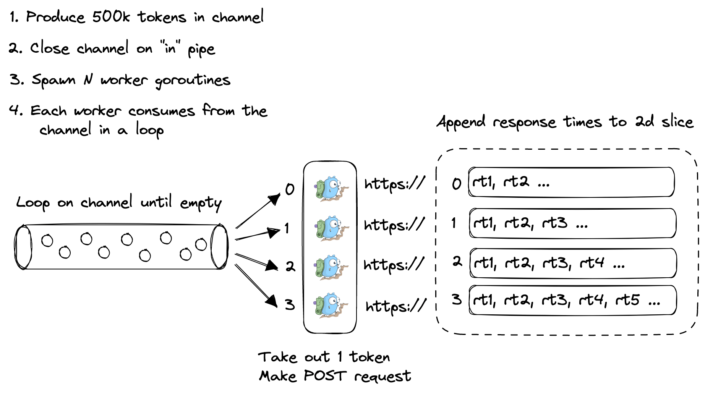
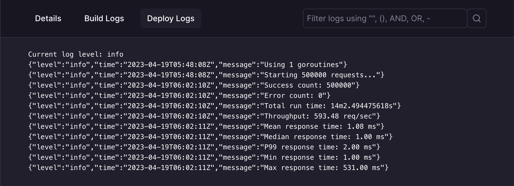
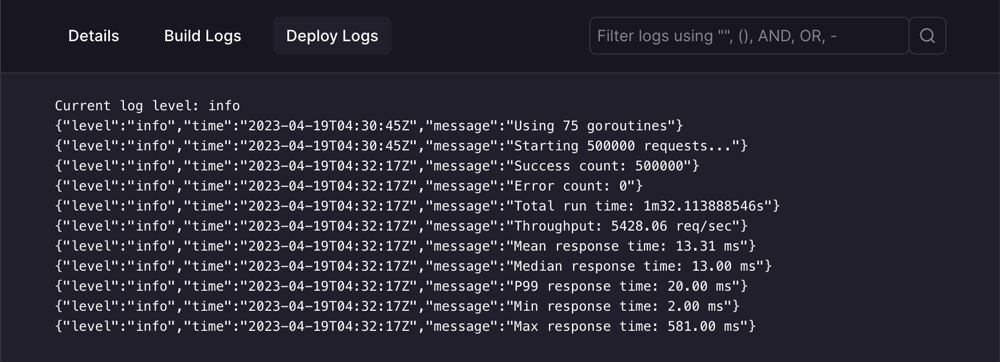
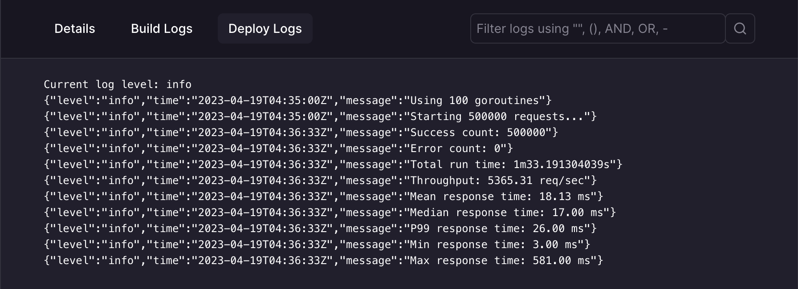

# Twinder Client

## Getting Started

### Build
```
make
```

### Run
```
./httpclient
```

### Deploy

Deployed on Railway.app

## Results

| Thread count | Throughtput (req/sec) | P99 response time (ms) |
| ------------ | --------------------- | ---------------------- |
| 1            | 593.48                | 2.00                   |
| 10           | 3525.35               | 5.00                   |
| 25           | 4284.47               | 10.00                  |
| 50           | 5324.35               | 15.00                  |
| 75           | 5428.06               | 20.00                  |
| 100          | 5365.31               | 26.00                  |

It seems like 50 threads is the optimal setup before significant diminishing returns.  
1.7 vCPU Peak  
20 MB Peak

## Design



## Screenshots

### 1 thread


### 25 threads


### 50 threads


### 75 threads


### 100 threads

